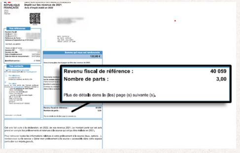

# Participation financière

La contribution des familles correspond à la participation financière demandée aux parents d'élèves. 

## **Frais de structure et adhésions**

Les frais de structure et de gestion s'articule de la façon suivante : 

- Contribution Garoneta
  
  > 240 € 

- Association Garoneta
  
  > 10 € par parent

- Association culturelle Cor D'oc
  
  > 2 € par parent

- Cotisation Fédération Régionale
  
  > 10 € par enfant

- Cotisation Fédération Départementale
  
  > 3 € par enfant

- Cotisation Confédération
  
  > 56 € par enfant (14 €/trimestre)

- Forfait papier
  
  > 6 € par enfant

- Classe verte (provision)
  
  > Maternelle: 60€
  
  > Primaire: 180

## Restauration scolaire

Les frais de restauration sont calculés en fonction du revenu fiscal de référence (RFR).
Pour vous situer dans une tranche : diviser le revenu fiscal du foyer par 12.

>  Grille tarifaire 2024

| **Revenu mensuel (RFR / 12)** | **A : Famille avec 1 enfant** | **B: Famille avec 2 enfant** | **C :Famille avec 3 enfants ou +** |
| ----------------------------- | ------------------------- | ------------------------- | ------------------------------- |
| 1 : 0 à 1 000 €                   | 1,16 €                    | 1,16 €                    | 1,16 €                          |
| 2 : 1 000 à 1 300 €               | 1,68 €                    | 1,68 €                    | 1,68 €                          |
| 3 : 1 300 à 1 600 €               | 2,42 €                    | 2,42 €                    | 2,42 €                          |
| 4 : 1 600 à 2 000 €               | 3,05 €                    | 3,05 €                    | 3,05 €                          |
| 5 : 2 000 à 2 400 €               | 3,47 €                    | 3,47 €                    | 3,47 €                          |
| 6 : 2 400 à 2 800 €               | 3,78 €                    | 3,78 €                    | 3,78 €                          |
| 7 : 2 800 à 3 200 €               | 4,10 €                    | 4,10 €                    | 4,10 €                          |
| 8 : 3 200 à 4 500 €               | 4,52 €                    | 4,52 €                    | 4,52 €                          |
| 9 : 4 500 à 6 000 €               | 5,04 €                    | 5,04 €                    | 5,04 €                          |
| 10 : 6 000 à 8 000 €               | 5,46 €                    | 5,46 €                    | 5,46 €                          |
| 11 : 8 000 € et plus               | 5,99 €                    | 5,99 €                    | 5,99 €                          |

## Centre de Loisirs Associé à l’école (CLAE)

La CLAE prend en charge les enfants le matin avant la classe, pendant la pause méridienne et le soir après la classe. L’association Calandreta est gestionnaire de son CLAE.

> Grille tarifaire de la prestation « Temps du matin »

| **Revenu mensuel (RFR / 12)** | **A : Famille avec 1 enfant** | **B : Famille avec 2 enfant** | **C : Famille avec 3 enfants ou +** |
| ----------------------------- | ------------------------- | ------------------------- | ------------------------------- |
| 1 : 0 à 1 000 €                   | 0,16 €                    | 0,16 €                    | 0,16 €                          |
| 2 : 1 000 à 1 300 €               | 0,32 €                    | 0,31 €                    | 0,29 €                          |
| 3 : 1 300 à 1 600 €               | 0,40 €                    | 0,38 €                    | 0,34 €                          |
| 4 : 1 600 à 2 000 €               | 0,50 €                    | 0,49 €                    | 0,45 €                          |
| 5 : 2 000 à 2 400 €               | 0,50 €                    | 0,49 €                    | 0,45 €                          |
| 6 : 2 400 à 2 800 €               | 0,50 €                    | 0,49 €                    | 0,45 €                          |
| 7 : 2 800 à 3 200 €               | 0,50 €                    | 0,49 €                    | 0,45 €                          |
| 8 : 3 200 à 4 500 €               | 0,67 €                    | 0,65 €                    | 0,63 €                          |
| 9 : 4 500 à 6 000 €               | 1,01 €                    | 0,99 €                    | 0,95 €                          |
| 10 : 6 000 à 8 000 €               | 1,19 €                    | 1,17 €                    | 1,13 €                          |
| 11 : 8 000 € et plus               | 1,35 €                    | 1,33 €                    | 1,30 €                          |

> Grille tarifaire de la prestation « Temps du midi »

| **Revenu mensuel (RFR / 12)** | **A : Famille avec 1 enfant** | **B : Famille avec 2 enfant** | **C : Famille avec 3 enfants ou +** |
| ----------------------------- | ------------------------- | ------------------------- | ------------------------------- |
| 0 à 1 000 €                   | 0,41 €                    | 0,41 €                    | 0,41 €                          |
| 1 000 à 1 300 €               | 0,85 €                    | 0,79 €                    | 0,72 €                          |
| 1 300 à 1 600 €               | 1,01 €                    | 0,97 €                    | 0,88 €                          |
| 1 600 à 2 000 €               | 1,26 €                    | 1,22 €                    | 1,13 €                          |
| 2 000 à 2 400 €               | 1,26 €                    | 1,22 €                    | 1,13 €                          |
| 2 400 à 2 800 €               | 1,26 €                    | 1,22 €                    | 1,13 €                          |
| 2 800 à 3 200 €               | 1,26 €                    | 1,22 €                    | 1,13 €                          |
| 3 200 à 4 500 €               | 1,69 €                    | 1,66 €                    | 1,57 €                          |
| 4 500 à 6 000 €               | 2,54 €                    | 2,50 €                    | 2,41 €                          |
| 6 000 à 8 000 €               | 2,97 €                    | 2,93 €                    | 2,84 €                          |
| 8 000 € et plus               | 3,40 €                    | 3,35 €                    | 3,28 €                          |

> Grille tarifaire de la prestation « Temps du soir »

| **Revenu mensuel (RFR / 12)** | **A : Famille avec 1 enfant** | **B : Famille avec 2 enfant** | **C : Famille avec 3 enfants ou +** |
| ----------------------------- | ------------------------- | ------------------------- | ------------------------------- |
| 1 : 0 à 1 000 €                   | 0,41 €                    | 0,41 €                    | 0,41 €                          |
| 2 : 1 000 à 1 300 €               | 0,85 €                    | 0,79 €                    | 0,72 €                          |
| 3 : 1 300 à 1 600 €               | 1,01 €                    | 0,97 €                    | 0,88 €                          |
| 4 : 1 600 à 2 000 €               | 1,26 €                    | 1,22 €                    | 1,13 €                          |
| 5 : 2 000 à 2 400 €               | 1,26 €                    | 1,22 €                    | 1,13 €                          |
| 6 : 2 400 à 2 800 €               | 1,26 €                    | 1,22 €                    | 1,13 €                          |
| 7 : 2 800 à 3 200 €               | 1,26 €                    | 1,22 €                    | 1,13 €                          |
| 8 : 3 200 à 4 500 €               | 1,69 €                    | 1,66 €                    | 1,57 €                          |
| 9 : 4 500 à 6 000 €               | 2,54 €                    | 2,50 €                    | 2,41 €                          |
| 10 : 6 000 à 8 000 €               | 2,97 €                    | 2,93 €                    | 2,84 €                          |
| 11 : 8 000 € et plus               | 3,40 €                    | 3,35 €                    | 3,28 €                          |

## Accueil de loisirs sans hébergement (ALSH) - Mercredi

Le mercredi, les enfants peuvent être accueillis soit pour une demi-journée, soit pour une journée complète. Le tarif est calculé en fonction du revenu fiscal de référence (RFR).

> Par demi-journée

| **Revenu mensuel (RFR / 12)** | **A : Famille avec 1 enfant** | **B : Famille avec 2 enfant** | **C : Famille avec 3 enfants ou +** |
| ----------------------------- | ------------------------- | ------------------------- | ------------------------------- |
| 1 : 0 à 1 000 €                   | 1,75 €                    | 1,58 €                    | 1,40 €                          |
| 2 : 1 000 à 1 300 €               | 2,25 €                    | 2,08 €                    | 1,90 €                          |
| 3 : 1 300 à 1 600 €               | 3,00 €                    | 2,70 €                    | 2,40 €                          |
| 4 : 1 600 à 2 000 €               | 3,75 €                    | 3,38 €                    | 3,00 €                          |
| 5 : 2 000 à 2 400 €               | 4,50 €                    | 4,05 €                    | 3,60 €                          |
| 6 : 2 400 à 2 800 €               | 6,00 €                    | 5,40 €                    | 4,80 €                          |
| 7 : 2 800 à 3 200 €               | 6,00 €                    | 5,40 €                    | 4,80 €                          |
| 8 : 3 200 à 4 500 €               | 6,50 €                    | 5,90 €                    | 5,50 €                          |
| 9 : 4 500 à 6 000 €               | 7,50 €                    | 6,75 €                    | 6,00 €                          |
| 10 : 6 000 à 8 000 €               | 8,75 €                    | 7,88 €                    | 7,00 €                          |
| 11 : 8 000 € et plus               | 8,75 €                    | 7,88 €                    | 7,00 €                          |

> Par journée

| **Revenu mensuel (RFR / 12)** | **A : Famille avec 1 enfant** | **B : Famille avec 2 enfant** | **C : Famille avec 3 enfants ou +** |
| ----------------------------- | ------------------------- | ------------------------- | ------------------------------- |
| 1 : 0 à 1 000 €                   | 2,88 €                    | 2,52 €                    | 1,98 €                          |
| 2 : 1 000 à 1 300 €               | 3,96 €                    | 3,60 €                    | 2,70 €                          |
| 3 : 1 300 à 1 600 €               | 5,40 €                    | 5,04 €                    | 3,96 €                          |
| 4 : 1 600 à 2 000 €               | 6,48 €                    | 5,94 €                    | 5,04 €                          |
| 5 : 2 000 à 2 400 €               | 7,74 €                    | 7,38 €                    | 6,30 €                          |
| 6 : 2 400 à 2 800 €               | 9,18 €                    | 8,64 €                    | 7,74 €                          |
| 7 : 800 à 3 200 €               | 10,44 €                   | 10,08 €                   | 9,00 €                          |
| 8 : 200 à 4 500 €               | 11,52 €                   | 11,16 €                   | 10,08 €                         |
| 9 : 4 500 à 6 000 €               | 12,78 €                   | 12,24 €                   | 11,34 €                         |
| 10 : 6 000 à 8 000 €               | 13,86 €                   | 13,32 €                   | 12,42 €                         |
| 11 : 8 000 € et plus               | 15,30 €                   | 14,94 €                   | 14,04 €                         |

  